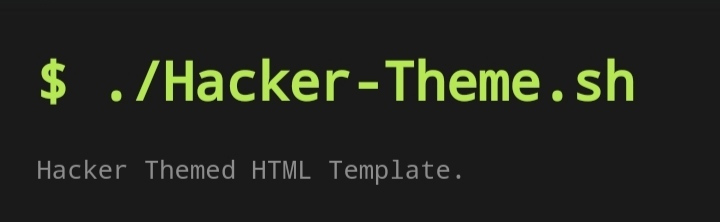

# hacker-theme

  
 

 
 

 
 

 

## About

This is a recreation of <a href="https://github.com/pages-themes/hacker">***pages-themes/hacker***</a> in `HTML`. 
The original project used **markdown** and **ruby(Jekyll highlighting)** for easy maintainability. 

This project simply allows you to host this theme in any standard web server, without any special needs (i.e. MD or Jekyll).

## Caution 
IP address is provided from
~~**api.ipify.org**. Read there **Policy** before deployment.~~
 

**Will Be Set To Manual.**

## Download

 

`git clone https://github.com/thelearn-tech/hacker-theme.git`

OR

<a href="https://github.com/thelearn-tech/hacker-theme/archive/refs/heads/main.zip">`Download as a  .zip`</a>

 

# Change Log

<a href="./CHANGELOG.md">***visit here***</a>

# Absolutely free to use

## resources

Code highlighting from <a href="https://github.com/googlearchive/code-prettify">code-prettify</a>
 
Footer from <a href="https://www.w3schools.com/w3css/4/w3.css">W3.css</a>
 
Font from <a href="https://cdnjs.cloudflare.com/ajax/libs/font-awesome/4.7.0/css/font-awesome.min.css">FontAwesone 4.7.0 CDN</a>
& 
<a href="https://fonts.googleapis.com/css?family=Lato">google's font family Lato</a>
